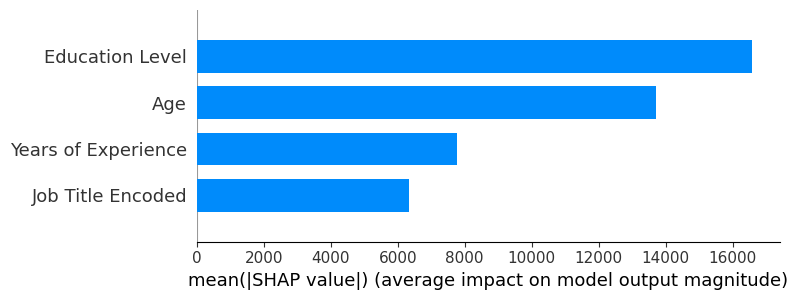
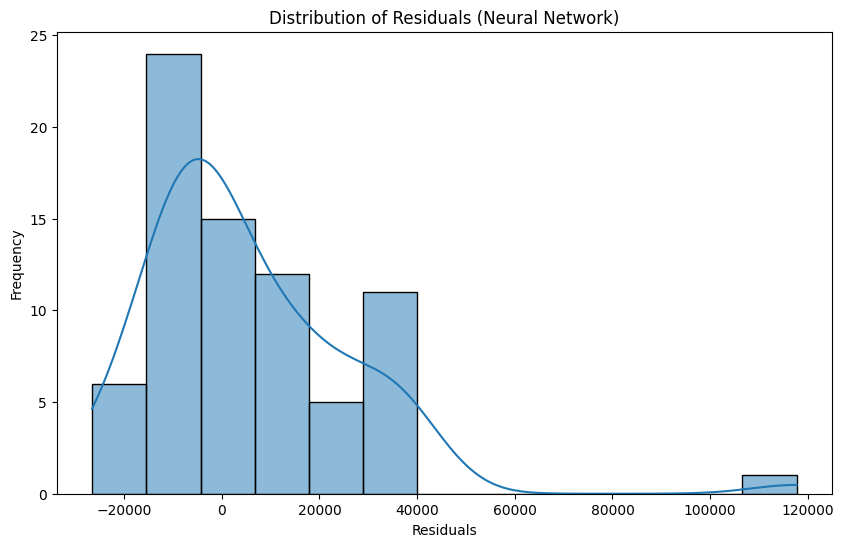
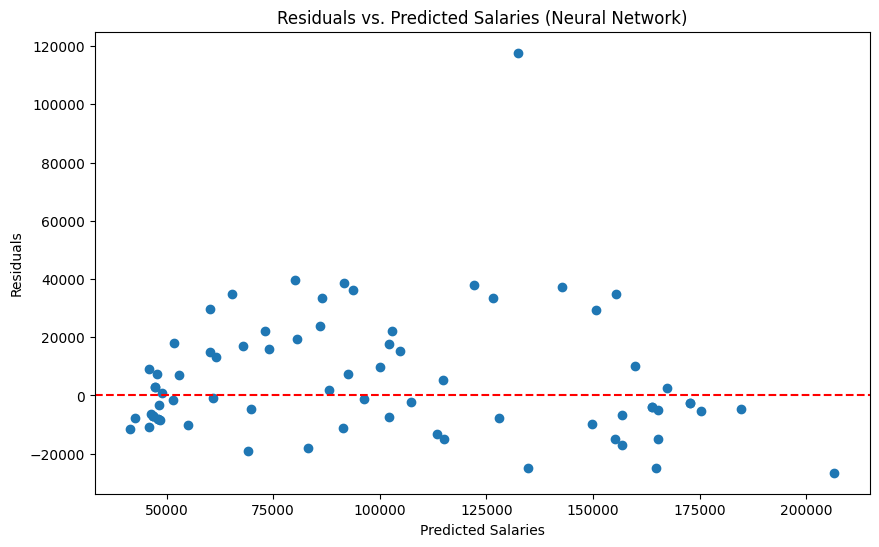

# Salary Predictive Model

## Overview
This project implements a machine learning pipeline to predict an individual's salary based on features such as age, gender, education level, job title, years of experience, and description. The solution includes data preprocessing, feature engineering, model training, evaluation, and visualization. The project is structured into modules and provides both a Gradio web interface and a FastAPI backend for making predictions.

## Quick Start

1. Clone and setup:
    ```sh
    git clone https://github.com/haervwe/salary_predictive_model.git
    cd salary_predictive_model
    python3 -m venv .venv
    source .venv/bin/activate
    pip install -r requirements.txt
    ```

2. To make predictions, use either:

    a. Web Interface (Recommended):
    ```sh
    python app.py
    ```
    Then open http://localhost:7860 in your browser

    b. REST API:
    ```sh 
    python api.py
    ```
    The API will be available at http://localhost:9988

    c. The inference witget at the end of the Jupyter Notebook

## Project Structure

### Documentation & Analysis
- **analysis.ipynb**: Jupyter notebook containing:
  - Data exploration and visualization
  - Model training process
  - Performance evaluation
  - Feature importance analysis
  - Comparative analysis of different models

### Core Modules

- **llm_dataset_filler.py**: Handles missing value imputation using a local LLM (Hermes 3) via Ollama or any OpenAI compatible endpoint.
- **feature_engineering.py**: Implements feature scaling, encoding, and selection
- **modeling.py**: Contains model training code for both Random Forest and Neural Network approaches
- **evaluation.py**: Provides metrics calculation and visualization functions
- **inference.py**: Core inference logic used by both UI and API

### Interfaces

- **app.py**: Gradio web interface for making predictions
- **api.py**: FastAPI backend service
- **inference_jupyter_form.py**: Interactive form widget for Jupyter

### Database

- **database.py**: SQLAlchemy database setup
- **db_model.py**: SQLAlchemy models
- **init_db.py**: Database initialization

## Key Features

- Missing value imputation using local LLM or any OpenAI compatible endpoint
- Feature engineering pipeline
- Model experimentation workflow
- Interactive web interface
- REST API endpoint
- Model performance analysis
- Prediction history tracking
- Comprehensive documentation

## Model Performance

### Neural Network Model

The Neural Network model achieved:

- **MSE**: 410,098,860.336 (95% CI: [172,791,209.008, 806,977,256.100])
- **MAE**: 12,925.254 (95% CI: [9,796.850, 17,131.055])
- **R2**: 0.831 (95% CI: [0.724, 0.912])

### Visualizations

#### Feature Correlation Heatmap


#### SHAP Summary Plot



#### Residuals Distribution



#### Residuals vs. Predicted Salaries



## Detailed Analysis

For a detailed analysis, including data preprocessing, feature engineering, model training, and evaluation, please refer to the [analysis notebook](./analysis.ipynb).

### Data Preprocessing
The data preprocessing pipeline consists of several key stages to prepare the dataset for modeling:
- **Data Loading**: Load multiple CSV files and merge them into a single DataFrame.
- **Data Cleansing and Imputation**: Handle missing values using a local LLM and remove duplicates and outliers.
- **Data Visualization**: Visualize the dataset to understand its distribution and relationships between features.

### Feature Engineering
- **Splitting Data**: Divide the dataset into training and testing subsets.
- **Data Normalization and Scaling**: Normalize and scale data to standardize features.
- **Feature Selection**: Select relevant features based on correlation and SHAP values.

### Model Training and Evaluation
- **Baseline Model**: Establish a baseline performance using a dummy regressor.
- **Random Forest Regressor**: Train a Random Forest Regressor and optimize its performance using grid search.
- **Neural Network Model**: Train a Neural Network model with a funnel architecture and evaluate its performance.

### Model Comparison
Compare the performance of all models using metrics such as MSE, MAE, and R2 to determine the best-performing model.

### Model Performance Comparison

#### MSE Comparison


#### MAE Comparison


#### R2 Comparison


### Inference witget
Simple inference witget to test the NN model.

## API Documentation

Once running, API documentation is available at:

- Swagger UI: http://localhost:9988/docs
- ReDoc: http://localhost:9988/redoc

